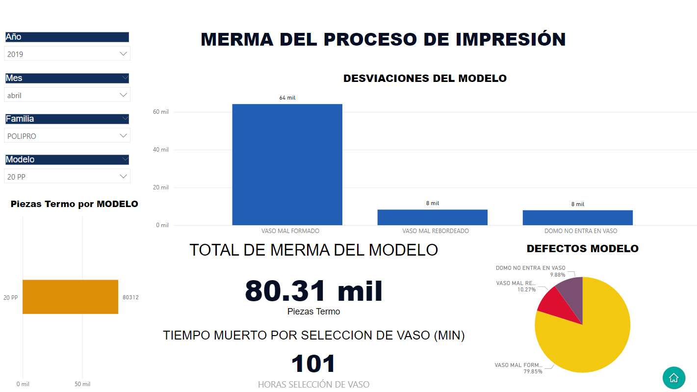

# Powerbi_waste_dashboard

## Dashboard de OEE y cuadro de perdida de tiempos.
- El objetivo de este proyecto fue implementar una herramienta de visualización de los kpi's de una empresa de producción masiva de vasos en la cual trabaje como Ingeniero de procesos, nos enfrentamos al tema que los reportes tomaban demasiado tiempo y no lograban en su mayoria de las veces estar en tiempo y forma para las juntas semanales, además que la información se encontraba dispersa en diferentes archivos, complicando su manejo y disponibilidad. Asi que mi propuesta fue estandarizar la información en un solo archivo de excel y visualizarlo en un PowerBI, mediante juntas semanales con los operadores fuimos puliendo el llenado de reportes, lo cual nos permitio que la información a analizar fuera más clara, esta herramienta de análisis se volvio indispensable para nuestras juntas de mejora continua ya que partiamos de los indicadores y mediante otras herramientas de lean manufacturing atendiamos las areas de oportunidad y al paso de una semana en la siguiente junta se revisaba el avance de estas medidas.

## Herramientas
 
  

## Metodología
**Estandarización de datos:**  
Contaba con una base de datos almacenada en una hoja de datos en Excel, donde tenia registros de la producción y los tiempos muertos, en un primer vistazo, verifique el origen de los datos y ajuste unas descripciones para que se adaptaran mejor a los reportes, se capacito al personal para el correcto de llenado de sus reportes, se capacito a una persona para la correcta captura de la información.  

**Creación de dashboard:**
Se rescataron los principales gráficos de los kpi's, mediante juntas con los dueños de los indicadores, Producción, mantenimiento y calidad, se realizo el levantamiento para los gráficos a utilizar, a su vez se revisaban con el gerente de planta para su posterior publicación.
En el caso del bloque de perdidas, se creo apartir de nuevas columnas calculadas en PowerBi, en donde se genero una función para que los valores en blanco fueran reemplazados por 0.

**Implementación de nuevos reportes:**  
Al contar con la información digitalizada de lo que se sucedia en piso, se lograron implementar nuevos reportes, como el bloque de perdidas y los defectos por modelo, que nos permitieron profundizar en el analisis de los indicadores y generar un plan de acción.

**Liberación y presentación a directivos:**
Posteriormente este Dashboard en PowerBi se utilizo para la presentación de reporte mensual a los directivos, el cual se presento como herramienta de analisis y a su vez sirvio para generar otros reportes que sirvieron como base para atacar áreas de oportunidad entre las distintas plantas. Como fue el caso del reporte de merma de impresión. 

**1. OEE por mes:**  
Mediante la implementación de este dashboad se presentaba el reporte diario de OEE de la planta, cuando implemente este dashboard en PowerBI reduje el retazo del indicador de 2 días a un turno, ya que sintetice y estandarice el llenado de reportes y su captura en una base de datos en excel, al tener un reporte automatizado en PowerBi, redujo el tiempo que me tomaba reportar los indicadores de eficiencia, al mismo tiempo que tenia mayor impacto visual y permitia la comparación con otras fechas o productos en tiempo real. Lo cual se volvio una gran herramienta para las juntas del equipo de mejora DMAIC, como nuestra principal herramienta de análisis.

**2. Bloque de perdidas:**   
La empresa para la que trabajaba en su mayoria se trabajaba 24/7, por lo que sabiamos que teniamos tiempos muertos, pero no sabiamos en que cantidad y cuales eran los más criticos, este grafico nos permitia visualizar la cantidad de minutos disponibles contra los producidos y localizar en que punto se encontraban las perdidas de tiempo. Así se podian tomar desciones en donde invertir recursos y monitorear el impacto.

**3. Merma de proceso de impresión:**  
Mediante este dashboard enfocado al indicador de calidad del proceso de impresión, se lograron clasificar las cantidades y las principales desviaciones de calidad por producto, esto nos permitio visualizar los principales defectos de calidad y posteriormente establecer un plan de mejora con la planta que proveeia estos productos y tras el primer trimestre tuvimos una reducción de la merma en un 25%.  

